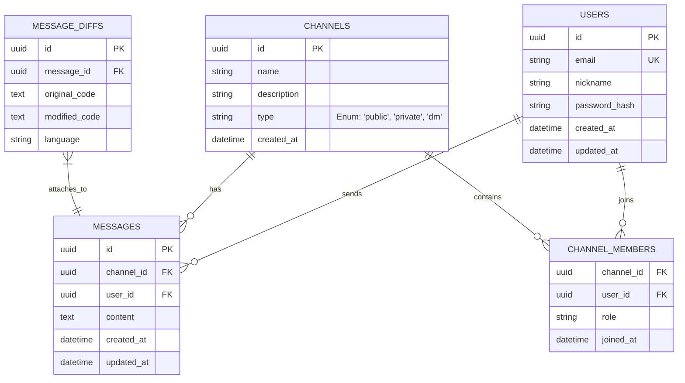

# Database Schema

Database schema design document for the backend implementation of the developer-centric messaging platform "WIP" using MySQL.

## ER Diagram

## Key Tables Specification

### 1. Users
Manages user authentication and profile information.
- `id` (UUID, Primary Key)
- `email` (String, Unique) - Used for login
- `nickname` (String) - Display name
- `password_hash` (String) - Encrypted password
- `created_at` (Timestamp)
- `updated_at` (Timestamp)

### 2. Channels
Manages communication spaces, including public channels, private channels, and Direct Messages (DMs).
- `id` (UUID, Primary Key)
- `name` (String, Nullable) - Channel name (Null for DMs, as UI renders the other user's name)
- `description` (String, Nullable) - Channel description
- `type` (String) - Distinguishes between 'public', 'private', and 'dm'
- `created_at` (Timestamp)

### 3. Channel Members
A mapping table that tracks which users are participating in which channels. For DMs, this will contain exactly 2 members.
- `channel_id` (UUID, Foreign Key)
- `user_id` (UUID, Foreign Key)
- `role` (String) - e.g., 'admin', 'member' 
- `joined_at` (Timestamp)

### 4. Messages
Stores text and markdown messages exchanged within channels or DMs.
- `id` (UUID, Primary Key)
- `channel_id` (UUID, Foreign Key)
- `user_id` (UUID, Foreign Key)
- `content` (Text) - Markdown body
- `created_at` (Timestamp)
- `updated_at` (Timestamp)

### 5. Message Diffs
A core feature table for "Live Diffing" in the WIP project. Relates 1:1 or N:1 with `Messages`.
- `id` (UUID, Primary Key)
- `message_id` (UUID, Foreign Key)
- `original_code` (Text) - Original code block
- `modified_code` (Text) - Modified code block
- `language` (String) - Language for syntax highlighting (e.g., Java, Python, JS)

## MySQL Notes

- Use the `InnoDB` engine for foreign key support and transactional safety.
- Use `utf8mb4` charset and collation to properly store markdown, emojis, and multilingual text.
- UUIDs can be stored as `CHAR(36)` or optimized as binary UUIDs depending on performance and indexing needs.
